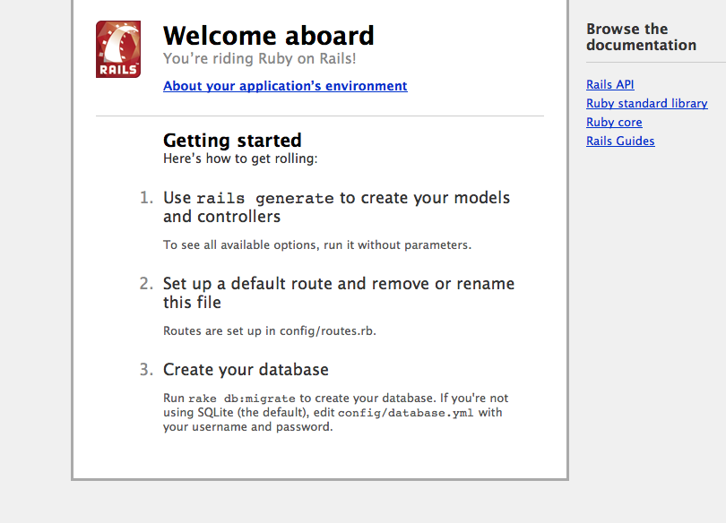

!SLIDE 

# create a Rails app #

!SLIDE commandline incremental

# If you don't have rails yet #

	$ gem install rails
	...
	Successfully installed rails-3.0.8
	22 gems installed
	...
	Installing ri documentation for rails-3.0.8...
	...
	Installing RDoc documentation for rails-3.0.8...

!SLIDE commandline incremental

	$ rails new adobemax-first-project
	create  
    create  README
    create  Rakefile
    create  config.ru
    create  .gitignore
    create  Gemfile
    create  app
    create  app/controllers/application_controller.rb
    create  app/helpers/application_helper.rb
	...
	
!SLIDE  commandline

# Change the Gemfile #

* replace gem 'sqlite3' by gem 'pg'
	
	$ brew install postgresql  
	$ env ARCHFLAGS="-arch x86_64" gem install pg
	Note: install's postgresql using homebrew
	
	$ bundle install
	
	$ git add .
	$ git commit -m "First checkin"
	
	
!SLIDE commandline incremental
	
# Send app to Heroku #
	
	$ git push heroku master
	-----> Heroku receiving push
	-----> Rails app detected
	-----> Detected Rails is not set to serve static_assets
	       Installing rails3_serve_static_assets... done
	-----> Configure Rails 3 to disable x-sendfile
	       Installing rails3_disable_x_sendfile... done
	-----> Configure Rails to log to stdout
	       Installing rails_log_stdout... done
	-----> Gemfile detected, running Bundler version 1.0.7
	       Unresolved dependencies detected; Installing...
	...
	-----> Compiled slug size is 3.9MB
	-----> Launching... done, v4
	       http://adobemax-first-project.heroku.com deployed to Heroku

!SLIDE  

# Other heroku commands #
	
!SLIDE commandline incremental
	
	$ heroku ps
	Process       State               Command
	------------  ------------------  ------------------------------
	web.1         up for 1m           thin -p $PORT -e $RACK_ENV -R $HER..
	
!SLIDE commandline incremental
	
	$ heroku logs
	2011-06-10T02:07:03+00:00 heroku[api]: Release v2 created by d@n-so.com
	2011-06-10T02:07:08+00:00 heroku[api]: Add-on update shared-database
	2011-06-10T02:07:08+00:00 heroku[api]: Release v3 created by d@n-so.com
	2011-06-09T20:57:23-07:00 heroku[slugc]: Slug compilation started
	2011-06-10T03:58:11+00:00 heroku[api]: Deploy 3897c3b by d@n-so.com
	2011-06-10T03:58:11+00:00 heroku[api]: Release v4 created by d@n-so.com
	2011-06-10T03:58:11+00:00 heroku[web.1]: State changed from created to starting
	2011-06-09T20:58:11-07:00 heroku[slugc]: Slug compilation finished
	2011-06-10T03:58:15+00:00 heroku[web.1]: Starting process with command: `thin -p 12924 -e production -R /home/heroku_rack/heroku.ru start`
	2011-06-10T03:58:17+00:00 app[web.1]: >> Thin web server (v1.2.6 codename Crazy Delicious)
	2011-06-10T03:58:17+00:00 app[web.1]: >> Maximum connections set to 1024
	2011-06-10T03:58:17+00:00 app[web.1]: >> Listening on 0.0.0.0:12924, CTRL+C to stop
	
!SLIDE center

# The App is live #
	
	http://adobemax-first-project.heroku.com
	http://freezing-autumn-489.herokuapp.com/	
	
	
	
!SLIDE commandline incremental

# Let's add some usefull code #
		
	$ rails generate scaffold post title:string body:text
      invoke  active_record
      create    db/migrate/20110610040608_create_posts.rb
      create    app/models/post.rb
      invoke    test_unit
      create      test/unit/post_test.rb
      create      test/fixtures/posts.yml
       route  resources :posts
      invoke  scaffold_controller
      create    app/controllers/posts_controller.rb
      invoke    erb
      create      app/views/posts
      create      app/views/posts/index.html.erb
      create      app/views/posts/edit.html.erb
      create      app/views/posts/show.html.erb
      create      app/views/posts/new.html.erb
      create      app/views/posts/_form.html.erb
      invoke    test_unit
      create      test/functional/posts_controller_test.rb
      invoke    helper
      create      app/helpers/posts_helper.rb
      invoke      test_unit
      create        test/unit/helpers/posts_helper_test.rb
      invoke  stylesheets
      create    public/stylesheets/scaffold.css	

!SLIDE commandline incremental

	$ heroku run rake db:migrate
	==  CreatePosts: migrating ====================================================
	-- create_table(:posts)
	   -> 0.0133s
	==  CreatePosts: migrated (0.0134s) ===========================================
	
	$ open http://freezing-autumn-489.herokuapp.com/posts
	
!SLIDE commandline incremental
	
	$ heroku run console
	Running console attached to terminal... up, run.2
	Loading production environment (Rails 3.0.8)
	irb(main):001:0> Post.count
	=> 0
	
	