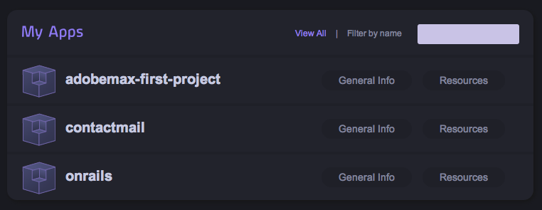

!SLIDE 

# Install the Heroku gem #

!SLIDE commandline incremental

	$ gem install heroku
	Fetching: term-ansicolor-1.0.5.gem (100%)
	Fetching: mime-types-1.16.gem (100%)
	Fetching: rest-client-1.6.3.gem (100%)
	Fetching: configuration-1.2.0.gem (100%)
	Fetching: launchy-0.4.0.gem (100%)
	Fetching: heroku-2.2.8.gem (100%)
	Successfully installed term-ansicolor-1.0.5
	Successfully installed mime-types-1.16
	Successfully installed rest-client-1.6.3
	Successfully installed configuration-1.2.0
	Successfully installed launchy-0.4.0
	Successfully installed heroku-2.2.8

!SLIDE

# Create a Rails app on Heroku #

!SLIDE smaller commandline 

	$ rails new adobemax-first-project
	$ cd adobemax-first-project
	# Edit Gemfile change gem 'sqlite' to gem 'pg'
	$ bundle install

!SLIDE smaller commandline 

	$ git init
	$ git add .
	$ git commit -m "init"
	
!SLIDE smaller commandline 
	
	$ heroku create --stack cedar
	Creating freezing-autumn-489... done, stack is cedar
	http://freezing-autumn-489.herokuapp.com/ | git@heroku.com:freezing-autumn-489.git
	Git remote heroku added
	
!SLIDE smaller commandline incremental
	
	$ git push heroku master
	-----> Heroku receiving push
	-----> Ruby/Rails app detected
	-----> Installing dependencies using Bundler version 1.1.pre.1
	...
	-----> Compiled slug size is 8.3MB
	-----> Launching... done, v5
	       http://freezing-autumn-489.herokuapp.com deployed to Heroku	
	
	
---------------------------------------------------
Slide after here are duplicates..

!SLIDE 

# Create an app on Heroku #

!SLIDE smaller commandline incremental

	$ heroku create adobemax-first-project --stack cedar
	Creating adobemax-first-project... done, stack is cedar
	http://adobemax-first-project.herokuapp.com/ | git@heroku.com:adobemax-first-project.git
	
	$ git clone git@heroku.com:adobemax-first-project.git
	Cloning into adobemax-first-project...
	warning: You appear to have cloned an empty repository.

!SLIDE center

## https://api.heroku.com/myapps ##

!SLIDE center

Note: new database and a single dyno allocated upon creation 